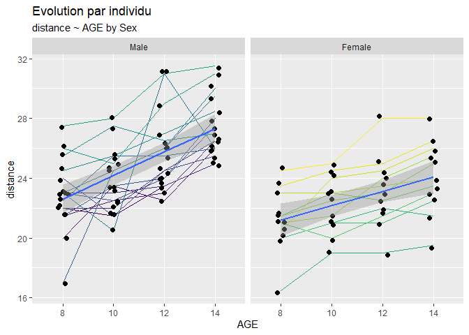

Merci à Christel Robert-Granié et Bertrand Servin pour leur aide et conseil.

## Packages requis

#### Ecriture des modèles:  
 - `library(lme4)`  
 - `library(lmerTest)`
 
#### Affichage des tables d'ANOVA:  
 - `library(car)`    
 
#### Tests Post-Hoc:  
 - `library(emmeans)`  
 - `library(multcomp)`  
 
#### Visualisation des tables:  
 - `library(DT)`  
 
#### Jeu de donnée data(Orthodont):  
 - `library(nlme)`  
  
#### Production des graphiques:  
 - `library(ggplot2)`  


>
Avant de réaliser les analyses, il est conseillé de changer les options par défaut du `contrast`  
>


```r
## Par défaut: options(contrasts = c("contr.treatment", "contr.poly"))
options(contrasts = c("contr.sum", "contr.poly"))
```

http://rcompanion.org/rcompanion/d_04.html  
http://goanna.cs.rmit.edu.au/~fscholer/anova.php  
http://md.psych.bio.uni-goettingen.de/mv/unit/lm_cat/lm_cat_unbal_ss_explained.html  
http://r.789695.n4.nabble.com/Setting-contrasts-td4681529.html  
http://www.clayford.net/statistics/tag/sum-contrasts/  


## Dataset

Caractéristiques du jeu de données:


```r
?Orthodont
```

>
The Orthodont data frame has 108 rows and 4 columns of the change in an orthodontic measurement over time for several young subjects.
This data frame contains the following columns:
 - distance: a numeric vector of distances from the pituitary to the pterygomaxillary fissure (mm). These distances are measured on x-ray images of the skull.  
 - age: a numeric vector of ages of the subject (year).  
 - Subject: an ordered factor indicating the subject on which the measurement was made. The levels are labelled M01 to M16 for the males and F01 to F13 for the females. The ordering is by increasing average distance within sex.  
 - Sex: a factor with levels Male and Female
>

### Présentation des données


```r
datatable(Orthodont)
```

<!--html_preserve--><div id="htmlwidget-82af16c284c2db12011e" style="width:100%;height:auto;" class="datatables html-widget"></div>
<script type="application/json" data-for="htmlwidget-82af16c284c2db12011e">{"x":{"filter":"none","data":[["1","2","3","4","5","6","7","8","9","10","11","12","13","14","15","16","17","18","19","20","21","22","23","24","25","26","27","28","29","30","31","32","33","34","35","36","37","38","39","40","41","42","43","44","45","46","47","48","49","50","51","52","53","54","55","56","57","58","59","60","61","62","63","64","65","66","67","68","69","70","71","72","73","74","75","76","77","78","79","80","81","82","83","84","85","86","87","88","89","90","91","92","93","94","95","96","97","98","99","100","101","102","103","104","105","106","107","108"],[26,25,29,31,21.5,22.5,23,26.5,23,22.5,24,27.5,25.5,27.5,26.5,27,20,23.5,22.5,26,24.5,25.5,27,28.5,22,22,24.5,26.5,24,21.5,24.5,25.5,23,20.5,31,26,27.5,28,31,31.5,23,23,23.5,25,21.5,23.5,24,28,17,24.5,26,29.5,22.5,25.5,25.5,26,23,24.5,26,30,22,21.5,23.5,25,21,20,21.5,23,21,21.5,24,25.5,20.5,24,24.5,26,23.5,24.5,25,26.5,21.5,23,22.5,23.5,20,21,21,22.5,21.5,22.5,23,25,23,23,23.5,24,20,21,22,21.5,16.5,19,19,19.5,24.5,25,28,28],[8,10,12,14,8,10,12,14,8,10,12,14,8,10,12,14,8,10,12,14,8,10,12,14,8,10,12,14,8,10,12,14,8,10,12,14,8,10,12,14,8,10,12,14,8,10,12,14,8,10,12,14,8,10,12,14,8,10,12,14,8,10,12,14,8,10,12,14,8,10,12,14,8,10,12,14,8,10,12,14,8,10,12,14,8,10,12,14,8,10,12,14,8,10,12,14,8,10,12,14,8,10,12,14,8,10,12,14],["M01","M01","M01","M01","M02","M02","M02","M02","M03","M03","M03","M03","M04","M04","M04","M04","M05","M05","M05","M05","M06","M06","M06","M06","M07","M07","M07","M07","M08","M08","M08","M08","M09","M09","M09","M09","M10","M10","M10","M10","M11","M11","M11","M11","M12","M12","M12","M12","M13","M13","M13","M13","M14","M14","M14","M14","M15","M15","M15","M15","M16","M16","M16","M16","F01","F01","F01","F01","F02","F02","F02","F02","F03","F03","F03","F03","F04","F04","F04","F04","F05","F05","F05","F05","F06","F06","F06","F06","F07","F07","F07","F07","F08","F08","F08","F08","F09","F09","F09","F09","F10","F10","F10","F10","F11","F11","F11","F11"],["Male","Male","Male","Male","Male","Male","Male","Male","Male","Male","Male","Male","Male","Male","Male","Male","Male","Male","Male","Male","Male","Male","Male","Male","Male","Male","Male","Male","Male","Male","Male","Male","Male","Male","Male","Male","Male","Male","Male","Male","Male","Male","Male","Male","Male","Male","Male","Male","Male","Male","Male","Male","Male","Male","Male","Male","Male","Male","Male","Male","Male","Male","Male","Male","Female","Female","Female","Female","Female","Female","Female","Female","Female","Female","Female","Female","Female","Female","Female","Female","Female","Female","Female","Female","Female","Female","Female","Female","Female","Female","Female","Female","Female","Female","Female","Female","Female","Female","Female","Female","Female","Female","Female","Female","Female","Female","Female","Female"]],"container":"<table class=\"display\">\n  <thead>\n    <tr>\n      <th> <\/th>\n      <th>distance<\/th>\n      <th>age<\/th>\n      <th>Subject<\/th>\n      <th>Sex<\/th>\n    <\/tr>\n  <\/thead>\n<\/table>","options":{"columnDefs":[{"className":"dt-right","targets":[1,2]},{"orderable":false,"targets":0}],"order":[],"autoWidth":false,"orderClasses":false}},"evals":[],"jsHooks":[]}</script><!--/html_preserve-->

Résumé des données 


```r
summary(Orthodont)
```

```
##     distance          age          Subject       Sex    
##  Min.   :16.50   Min.   : 8.0   M16    : 4   Male  :64  
##  1st Qu.:22.00   1st Qu.: 9.5   M05    : 4   Female:44  
##  Median :23.75   Median :11.0   M02    : 4              
##  Mean   :24.02   Mean   :11.0   M11    : 4              
##  3rd Qu.:26.00   3rd Qu.:12.5   M07    : 4              
##  Max.   :31.50   Max.   :14.0   M08    : 4              
##                                 (Other):84
```

Structure de l'objet tranformé en data.frame


```r
str(as.data.frame(Orthodont))
```

```
## 'data.frame':	108 obs. of  4 variables:
##  $ distance: num  26 25 29 31 21.5 22.5 23 26.5 23 22.5 ...
##  $ age     : num  8 10 12 14 8 10 12 14 8 10 ...
##  $ Subject : Ord.factor w/ 27 levels "M16"<"M05"<"M02"<..: 15 15 15 15 3 3 3 3 7 7 ...
##  $ Sex     : Factor w/ 2 levels "Male","Female": 1 1 1 1 1 1 1 1 1 1 ...
```

Ajoute la variable `AGE` correspondant à la variable `age` transformée en facteur


```r
Orthodont$AGE <- as.factor(Orthodont$age)
```


```r
summary(Orthodont)
```

```
##     distance          age          Subject       Sex     AGE    
##  Min.   :16.50   Min.   : 8.0   M16    : 4   Male  :64   8 :27  
##  1st Qu.:22.00   1st Qu.: 9.5   M05    : 4   Female:44   10:27  
##  Median :23.75   Median :11.0   M02    : 4               12:27  
##  Mean   :24.02   Mean   :11.0   M11    : 4               14:27  
##  3rd Qu.:26.00   3rd Qu.:12.5   M07    : 4                      
##  Max.   :31.50   Max.   :14.0   M08    : 4                      
##                                 (Other):84
```

On note un déséquilibre des effectifs : 64 males, 44 femelles, pas de données manquantes  

<Br>
<Br>

### Représentation graphique avec `ggplot2`


```r
p <- ggplot(data = Orthodont, aes(x = AGE, y = distance, group = Subject))
p + geom_line(aes(color = Subject)) +
    geom_jitter(width = 0.1, size = 2) +
    facet_grid(~Sex) +
    geom_smooth(method='lm',aes(group=Sex))  +
  labs(title = "Evolution par individu",
         subtitle = "distance ~ AGE by Sex") +
    theme(legend.position = 'none')
```

<!-- -->
  
Les graphiques montrent une forte variabilité liée à l'individu et vraissemblablement à:   
  1- un effet AGE  
  2- un effet Sexe  
  3- une interaction AGE * Sexe : les pentes des males semblent plus fortes mais ce n'est pas flagrant

On note le déséquilibre des effectifs : 16 males, 11 femelles, pas de données manquantes  

## Modele ANOVA 

### Avec la fonction `lm()` simple

Les pré-requis pour la réalisation d'une ANOVA sont :  

- un dispositif équilibré en effectif
- homoscedasticité : les variances entre groupes sont égales
- une distribution normale des résidus (en lien avec la distribution de la variable)
- **indépendance des observations**  

A priori, ce modèle n'est pas adapté pour l'analyse du jeu de donnees `Orthodont` car les effectifs sont déséquilibrés  et il n'y a pas indépendance des observations : la variable est mesurée plusieurs fois sur le même individu.

Dans un modèle linéaire la variable liée à l'âge peut être implémentée comme un facteur (variable qualitative non ordonnée) ou traitée en variable continue. En considérant l'âge comme variable qualitative, le test de l'interaction AGE * Sex  "coûte cher" (3 degrés de libertés) vs. dans le cas de l'âge en variable continue (1 ddl). 

**Cas de l'âge en variable qualitative avec les fonction `Anova` et `anova`**


```r
mod_lm <- lm(distance ~ AGE * Sex , data = Orthodont)
car::Anova(mod_lm, type="III")
```

```
## Anova Table (Type III tests)
## 
## Response: distance
##             Sum Sq  Df    F value    Pr(>F)    
## (Intercept)  59119   1 11238.3484 < 2.2e-16 ***
## AGE            209   3    13.2712 2.319e-07 ***
## Sex            140   1    26.7022 1.216e-06 ***
## AGE:Sex         14   3     0.8867    0.4508    
## Residuals      526 100                         
## ---
## Signif. codes:  0 '***' 0.001 '**' 0.01 '*' 0.05 '.' 0.1 ' ' 1
```

```r
anova(mod_lm) # type "II" par défaut mais ne doit être utilisé que si les effectifs sont équilibrés
```

```
## Analysis of Variance Table
## 
## Response: distance
##            Df Sum Sq Mean Sq F value    Pr(>F)    
## AGE         3 237.19  79.064 15.0300 3.790e-08 ***
## Sex         1 140.46 140.465 26.7022 1.216e-06 ***
## AGE:Sex     3  13.99   4.664  0.8867    0.4508    
## Residuals 100 526.04   5.260                      
## ---
## Signif. codes:  0 '***' 0.001 '**' 0.01 '*' 0.05 '.' 0.1 ' ' 1
```
  
Les résultats diffèrent selon la fonction utilisée. Le type d'erreur testé n'est pas le même :  
  
- `car::Anova(mod_lm, type="III")`, type III demandé  
- `anova`, type II par défaut
  

**Cas de l'âge en variable continue**


```r
mod_lm <- lm(distance ~ age * Sex , data = Orthodont)
car::Anova(mod_lm, type="III")
```

```
## Anova Table (Type III tests)
## 
## Response: distance
##              Sum Sq  Df  F value    Pr(>F)    
## (Intercept) 1176.01   1 230.8707 < 2.2e-16 ***
## age          208.27   1  40.8860 4.673e-09 ***
## Sex            1.10   1   0.2164    0.6428    
## age:Sex       12.11   1   2.3782    0.1261    
## Residuals    529.76 104                       
## ---
## Signif. codes:  0 '***' 0.001 '**' 0.01 '*' 0.05 '.' 0.1 ' ' 1
```

```r
anova(mod_lm)
```

```
## Analysis of Variance Table
## 
## Response: distance
##            Df Sum Sq Mean Sq F value    Pr(>F)    
## age         1 235.36 235.356 46.2042 6.884e-10 ***
## Sex         1 140.46 140.465 27.5756 8.054e-07 ***
## age:Sex     1  12.11  12.114  2.3782    0.1261    
## Residuals 104 529.76   5.094                      
## ---
## Signif. codes:  0 '***' 0.001 '**' 0.01 '*' 0.05 '.' 0.1 ' ' 1
```
  
Lorsque l'âge est pris comme une variable continue, les résultats obtenus sont diffèrent.  
En effet, avec `car::Anova(mod_lm ,type III)`, il n'y a pas d'effet Sex !

>
**RAPPELONS** dans ce cas quel que soit la forme de la variable `age` le modèle `lm()` ne doit pas etre utilisé. Il faut tenir compte de la répétition !
> 

### Réalisation d'une ANOVA avec données répétées  
  
On peut utiliser la fonction `aov()` mais celle-ci:

- n'est pas adaptée en cas de données manquantes ou de déséquilibre des effectifs  
- et surtout ne permet pas d'obtenir les tests post-Hoc  


```r
mod_aov_rep<-aov(distance ~ AGE * Sex + Error(Subject), data = Orthodont)
summary(aov(distance ~ AGE * Sex + Error(Subject), data = Orthodont), type = "III") 
```

```
## 
## Error: Subject
##           Df Sum Sq Mean Sq F value  Pr(>F)   
## Sex        1  140.5  140.46   9.292 0.00538 **
## Residuals 25  377.9   15.12                   
## ---
## Signif. codes:  0 '***' 0.001 '**' 0.01 '*' 0.05 '.' 0.1 ' ' 1
## 
## Error: Within
##           Df Sum Sq Mean Sq F value   Pr(>F)    
## AGE        3 237.19   79.06  40.032 1.49e-15 ***
## AGE:Sex    3  13.99    4.66   2.362   0.0781 .  
## Residuals 75 148.13    1.98                     
## ---
## Signif. codes:  0 '***' 0.001 '**' 0.01 '*' 0.05 '.' 0.1 ' ' 1
```
  
Dans ce modèle la variance est décomposée en deux parties l'une pour l'effet aléatoire individu et l'autre pour la résiduelle.  
Ce modèle est identique au modele mixte pour peu que l'on respecte les conditions d'utilisation de l'ANOVA et notamment des effectifs equilibrés.

## Modèle mixte

 - variable réponse = **`distance`**
 - variable explicatives à effets fixe = **`Sex, AGE`**
 - Variable explicative à effet aléatoire = **`Subject`**
  
### Les packages et les fonctions :  

Les packages:  

 - `library(lme4)`
 - `library(lmerTest)`
 
Les fonctions:
   
 - `lmer()`
 - `update()`
 - `VarCorr()`
 - `AIC()`
 - `BIC()`
 
### Les méthodes REML et ML d'estimation

Il existe 2 méthodes d'ajustement d'un modèle mixte, la méthode REML et la méthode ML.  
<br/>
REML est une méthode de vraissemblance restreinte. Elle est particulièrement adaptée aux jeux de données présentant des données manquantes. Elle permet également d'étudier au mieux les effets aléatoires.  

Par contre lorsqu'on s'intéresse aux effets fixes, la méthode "ML" (Maximum Likehood) est recommandée.  
Toutefois cette dernière conduit à des estimations biaisées (trop faibles) des composantes de la variance.  
La démarche préconisée est la suivante :  

- estimer le modèle avec la methode REML
- une fois le modèle estimé, ajuster avec la methode ML en utilisant la fonction `update()` 

La fonction `lmer()` utilise par défaut la methode REML. Cette fonction est implementée dans les packages `lme4` et `lmerTest`.

- `lme4::lmer` ne donne pas accès aux p-values.   
- `lmerTest::lmer` donne accès aux p-values.    

>  
**--> Utiliser la fonction `lmer()` du package `lmerTest` pour avoir accès aux p-Values et implémenter d'abord la méthode REML puis ajuster avec la méthode ML** 
>

### Ecriture du modèle avec la fonction `lmerTest::lmer`, la méthode REML et l'ajustement avec ML  

Ecriture du modèle avec REML puis ML pour corriger l'effet individu sur l'intercept  


```r
# estimation du modèle
mod_lmer_REML <- lmerTest::lmer(distance ~ Sex * AGE + (1|Subject), data = Orthodont) # par défaut méthode REML
# ajustement pour l'estimation des effets fixes
mod_lmer_ML <- update(mod_lmer_REML, REML=FALSE)
```

Validation du gain lié à la réestimation du modèle par la méthode ML


```r
lme4::VarCorr(mod_lmer_REML)
##  Groups   Name        Std.Dev.
##  Subject  (Intercept) 1.8126  
##  Residual             1.4054
```


```r
lme4::VarCorr(mod_lmer_ML)
##  Groups   Name        Std.Dev.
##  Subject  (Intercept) 1.7441  
##  Residual             1.3523
```
  
La fonction `Varcorr()` permet d'extraire la variance des composantes. La réestimation du modèle avec la méthode ML permet ainsi de diminuer la variance de la résiduelle et de l'effet aléatoire.  


```r
car::Anova(mod_lmer_ML, type = "III")
## Analysis of Deviance Table (Type III Wald chisquare tests)
## 
## Response: distance
##                 Chisq Df Pr(>Chisq)    
## (Intercept) 4223.7024  1  < 2.2e-16 ***
## Sex           10.0355  1   0.001536 ** 
## AGE          114.5254  3  < 2.2e-16 ***
## Sex:AGE        7.6515  3   0.053792 .  
## ---
## Signif. codes:  0 '***' 0.001 '**' 0.01 '*' 0.05 '.' 0.1 ' ' 1
```

## Comment évaluer la qualité d'ajustement d'un modèle ?
  
### Les modèles emboités pour valider les effets  
   
**Test de l'intérêt de l'addition d'un effet aléatoire sur l'intercept**  
  
Il s'agit de comparer le modèle mixte et le modèle ANOVA


```r
# modele mixte avec effets fixes et subject en aléatoire sur l'intercept
# estimation du modèle
mod_lmer_REML <- lmerTest::lmer(distance ~ Sex * AGE + (1|Subject), data = Orthodont) # par défaut methode REML
# ajustement pour l'estimation des effets fixes
mod_lmer_ML <- update(mod_lmer_REML, REML=FALSE)
# Anova
mod_lm <- lm(distance ~ Sex * AGE , data = Orthodont)
```

Comparaison (plus la valeur est basse, meilleur est l'ajustement)


```r
anova(mod_lmer_ML, mod_lm)
## Data: Orthodont
## Models:
## mod_lm: distance ~ Sex * AGE
## mod_lmer_ML: distance ~ Sex * AGE + (1 | Subject)
##             Df    AIC    BIC  logLik deviance  Chisq Chi Df Pr(>Chisq)    
## mod_lm       9 495.48 519.62 -238.74   477.48                             
## mod_lmer_ML 10 446.63 473.45 -213.32   426.63 50.849      1  9.976e-13 ***
## ---
## Signif. codes:  0 '***' 0.001 '**' 0.01 '*' 0.05 '.' 0.1 ' ' 1
```

L'effet aléatoire apporte une plus-value significative dans le modèle d'estimation

**Test de l'intérêt de l'effet fixe par rapport à l'aléatoire seul**


```r
# modèle avec l'effet aleatoire seul
mod_lmer_REML_ssfixe <- lmerTest::lmer(distance ~ 1 + (1|Subject), data = Orthodont) 
mod_lmer_ML_ssfixe <- update(mod_lmer_REML_ssfixe, REML = FALSE) 

# modèle mixte avec effets fixes et subject en aléatoire sur l'intercept
mod_lmer_REML_intercept <- lmerTest::lmer(distance ~ AGE * Sex + (1|Subject), data = Orthodont)
mod_lmer_ML_intercept<-update(mod_lmer_REML_intercept, REML = FALSE)
```

Comparaison  (plus la valeur est basse, meilleur est l'ajustement)


```r
anova(mod_lmer_ML_ssfixe, mod_lmer_ML_intercept)
## Data: Orthodont
## Models:
## mod_lmer_ML_ssfixe: distance ~ 1 + (1 | Subject)
## mod_lmer_ML_intercept: distance ~ AGE * Sex + (1 | Subject)
##                       Df    AIC    BIC  logLik deviance  Chisq Chi Df
## mod_lmer_ML_ssfixe     3 521.49 529.54 -257.75   515.49              
## mod_lmer_ML_intercept 10 446.63 473.45 -213.32   426.63 88.858      7
##                       Pr(>Chisq)    
## mod_lmer_ML_ssfixe                  
## mod_lmer_ML_intercept  < 2.2e-16 ***
## ---
## Signif. codes:  0 '***' 0.001 '**' 0.01 '*' 0.05 '.' 0.1 ' ' 1
```
  
Les effets fixes améliorent l'ajustement du modèle  
  
**Modèle pour corriger l'intercept et la pente**


```r
# modèle intercept
mod_lmer_REML_intercept <- lmerTest::lmer(distance ~ Sex * AGE + (1|Subject), data = Orthodont)
mod_lmer_ML_intercept <- update(mod_lmer_REML_intercept, REML = FALSE)

# modèle intercept + pente
mod_lmer_REML_intercept_pente <- lmerTest::lmer(distance ~ Sex * AGE + (age|Subject), data = Orthodont)
mod_lmer_ML_intercept_pente <- update(mod_lmer_REML_intercept_pente, REML = FALSE)
```

Comparaison (plus la valeur est basse, meilleur est l'ajustement)


```r
anova(mod_lmer_ML_intercept, mod_lmer_ML_intercept_pente)
## Data: Orthodont
## Models:
## mod_lmer_ML_intercept: distance ~ Sex * AGE + (1 | Subject)
## mod_lmer_ML_intercept_pente: distance ~ Sex * AGE + (age | Subject)
##                             Df    AIC    BIC  logLik deviance  Chisq
## mod_lmer_ML_intercept       10 446.63 473.45 -213.32   426.63       
## mod_lmer_ML_intercept_pente 12 449.60 481.78 -212.80   425.60 1.0359
##                             Chi Df Pr(>Chisq)
## mod_lmer_ML_intercept                        
## mod_lmer_ML_intercept_pente      2     0.5957
```

La correction par la pente ne permet pas un meilleur ajustement du modèle, toutefois ici la correction par la pente est faite par l'age sous forme d'une variable continue.  
  
NB: l'écriture de ces deux modèles est équivalente :  
`lmerTest::lmer(distance ~ Sex * AGE + (1 + age|Subject), data = Orthodont)`  
`lmerTest::lmer(distance ~ Sex * AGE + (age|Subject), data = Orthodont)`  

### Comparaison des modèles par les criteres AIC et BIC

AIC : critère d'Akaike (Akaike Information Criterion)  
BIC : Bayesian Information Criterion


```r
criterLM <- c(AIC = AIC(mod_lm), BIC = BIC(mod_lm))
criterLMER_ssfixe <- c(AIC = AIC(mod_lmer_ML_ssfixe), BIC = BIC(mod_lmer_ML_ssfixe))
criterLMER_intercept <- c(AIC = AIC(mod_lmer_ML_intercept), BIC = BIC(mod_lmer_ML_intercept))
criterLMER_intercept_pente <- c(AIC = AIC(mod_lmer_ML_intercept_pente), BIC = BIC(mod_lmer_ML_intercept_pente))
rbind(criterLM, criterLMER_ssfixe, criterLMER_intercept, criterLMER_intercept_pente)
```

```
##                                 AIC      BIC
## criterLM                   495.4818 519.6210
## criterLMER_ssfixe          521.4911 529.5375
## criterLMER_intercept       446.6329 473.4542
## criterLMER_intercept_pente 449.5970 481.7826
```

Plus la valeur est basse, meilleur est l'ajustement. Ici, le modèle permettant le meilleur ajustement est le modèle `mod_lmer_ML_intercept`


### Résumé des écritures de différents modèles

Modèle sans effet fixe et subject en aléatoire sur l'intercept
`lmerTest::lmer(distance ~ 1 + (1|Subject), data = Orthodont)`

Modèle sans effet fixe et AGE en aléatoire sur la pente (deux écritures possibles pour ne garder que l'effet aléatoire AGE sur la pente)
`lmerTest::lmer(distance ~ 1 + (0 + AGE|Subject), data = Orthodont)`
`lmerTest::lmer(distance ~ 1 + (AGE - 1|Subject), data = Orthodont)`

Modèle sans effet fixe et  subject en aléatoire sur l'intercept et AGE en aleatoire sur la pente
`lmerTest::lmer(distance ~ 1 + (AGE|Subject), data = Orthodont)`  

Modèle avec effet fixe et le sujet en aléatoire sur l'intercept  
`lmerTest::lmer(distance ~ AGE * Sex + (1|Subject), data = Orthodont)`  

Modèle avec effet fixe et le sujet sur l'intercept et l'AGE sur la pente en aléatoire  
`lmerTest::lmer(distance ~ AGE * Sex (AGE|Subject), data = Orthodont)`  

Modèle avec effet fixe sans intercept, mais uniquement la pente en aléatoire  
`lmerTest::lmer(distance ~ AGE * Sex + (0 + AGE|Subject), data = Orthodont)`  

Modèle avec effet fixe et intercept et pente en aléatoire et non correlée  
`lmerTest::lmer(distance ~ Sex * AGE + (age||Subject), data = Orthodont)`  

Modèle avec effet fixe et effet aléatoire subject avec sex niche dans subject
`lmerTest::lmer(distance ~ Sex + AGE + (1|Subject:Sex), data = Orthodont)`
`lmerTest::lmer(distance ~ Sex + AGE + (1|Subject) + (1|Subject:Sex), data = Orthodont)`
`lmerTest::lmer(distance ~ Sex + AGE + (1|Subject/Sex), data = Orthodont)`
`lmerTest::lmer(distance ~ Sex + AGE + (1|Sex/Subject), data = Orthodont)`  

NB: on peut additionner différents effets aléatoires  
`lmer(Y ~ 1 + (1 | A) + (1 | B), data = d)`
`lmer(Y ~ 1 + (1 | A) + (1 | A:B), data = d)`
`lmer(Y ~ 1 + (1 | A/B), data = d)`

## Calcul des moyennes ajustées : Lsmeans

Les **moyennes ajustéees** ou Lsmeans, permettent d'illustrer l'effet d'une variable en particulier sur la variable réponse. L'effet des autres variables sur la variable dépendante étant fixe.  
  
les packages:  
- `library(emmeans)`  
- `library(lmerTest)`  
  
Les fonctions:  
- `emmeans::lsmeans()`  
- `lmerTest::lsmeansLT()`  
- `CLD()`  
- `pairs()`  


ATTENTION: La fonction `lsmeans()` est présente dans le package `emmeans`, le package `lsmeans` n'est plus disponible. Dans le package `lmerTest`, elle a été renomée en `lsmeansLT`
  
Différentes fonctions de différents packages ont été testées et ne donnent pas exactement les mêmes résultats. `emmeans::lsmeans` est plus souple d'utilisation et permet de tester les intéractions.  

C'est donc celle-ci qui est préconisée.


```r
mod_lmer_REML <- lmerTest::lmer(distance ~ AGE * Sex + (1|Subject), data = Orthodont)
mod_lmer_ML <- update(mod_lmer_REML, REML=FALSE)
car::Anova(mod_lmer_ML, type= "III")
## Analysis of Deviance Table (Type III Wald chisquare tests)
## 
## Response: distance
##                 Chisq Df Pr(>Chisq)    
## (Intercept) 4223.7024  1  < 2.2e-16 ***
## AGE          114.5254  3  < 2.2e-16 ***
## Sex           10.0355  1   0.001536 ** 
## AGE:Sex        7.6515  3   0.053792 .  
## ---
## Signif. codes:  0 '***' 0.001 '**' 0.01 '*' 0.05 '.' 0.1 ' ' 1
```


```r
emmeans::lsmeans(mod_lmer_ML, "AGE")
## NOTE: Results may be misleading due to involvement in interactions
##  AGE lsmean    SE   df lower.CL upper.CL
##  8     22.0 0.449 53.8     21.1     22.9
##  10    23.0 0.449 53.8     22.1     23.9
##  12    24.4 0.449 53.8     23.5     25.3
##  14    25.8 0.449 53.8     24.9     26.7
## 
## Results are averaged over the levels of: Sex 
## Degrees-of-freedom method: kenward-roger 
## Confidence level used: 0.95
```


```r
lmerTest::lsmeansLT(mod_lmer_ML, "AGE")
## Least Squares Means table:
## 
##       Estimate Std. Error   df t value    lower    upper  Pr(>|t|)    
## AGE8  22.02841    0.43221 49.8  50.967 21.16019 22.89663 < 2.2e-16 ***
## AGE10 23.01989    0.43221 49.8  53.261 22.15167 23.88811 < 2.2e-16 ***
## AGE12 24.40483    0.43221 49.8  56.465 23.53661 25.27305 < 2.2e-16 ***
## AGE14 25.77983    0.43221 49.8  59.647 24.91161 26.64805 < 2.2e-16 ***
## ---
## Signif. codes:  0 '***' 0.001 '**' 0.01 '*' 0.05 '.' 0.1 ' ' 1
## 
##   Confidence level: 95%
##   Degrees of freedom method: Satterthwaite
```

### Tests Post-Hoc
  
Les fonctions `pairs()` et `CLD()` sont utilisées pour réaliser les tests de comparaisons de moyennes.  
La fonction `CLD()` permet de récupérer les lettres différentes au seuil de 0.05.  
  
#### Tests Post-Hoc sur un effet fixe si pas d'intéraction

>
Attention: la fonction `CLD()` n'est pas applicable à un objet de classe glht issu du packge `multcomp`
>


```r
# avec le package emmeans
pairs(emmeans::lsmeans(mod_lmer_ML,"AGE"))
```

```
## NOTE: Results may be misleading due to involvement in interactions
```

```
##  contrast estimate    SE   df t.ratio p.value
##  8 - 10     -0.991 0.389 87.5 -2.547  0.0597 
##  8 - 12     -2.376 0.389 87.5 -6.106  <.0001 
##  8 - 14     -3.751 0.389 87.5 -9.638  <.0001 
##  10 - 12    -1.385 0.389 87.5 -3.558  0.0033 
##  10 - 14    -2.760 0.389 87.5 -7.091  <.0001 
##  12 - 14    -1.375 0.389 87.5 -3.533  0.0036 
## 
## Results are averaged over the levels of: Sex 
## Degrees-of-freedom method: kenward-roger 
## P value adjustment: tukey method for comparing a family of 4 estimates
```

```r
CLD(emmeans::lsmeans(mod_lmer_ML,"AGE"), Letters = letters)
```

```
## Warning: 'CLD' will be deprecated. Its use is discouraged.
## See '? CLD' for an explanation. Use 'pwpp' or 'multcomp::cld' instead.
```

```
## NOTE: Results may be misleading due to involvement in interactions
```

```
##  AGE lsmean    SE   df lower.CL upper.CL .group
##  8     22.0 0.449 53.8     21.1     22.9  a    
##  10    23.0 0.449 53.8     22.1     23.9  a    
##  12    24.4 0.449 53.8     23.5     25.3   b   
##  14    25.8 0.449 53.8     24.9     26.7    c  
## 
## Results are averaged over the levels of: Sex 
## Degrees-of-freedom method: kenward-roger 
## Confidence level used: 0.95 
## P value adjustment: tukey method for comparing a family of 4 estimates 
## significance level used: alpha = 0.05
```

```r
# avec le package lmerTest
# la fonction cld() ne fonctionne pas sur un objet lmerTest
lmerTest::difflsmeans(mod_lmer_ML, test.effs = "AGE")
```

```
## Least Squares Means table:
## 
##                                    Estimate Std. Error   df  t value
## AGE8 - AGE10                      -0.991477   0.374530 81.0  -2.6473
## AGE8 - AGE12                      -2.376420   0.374530 81.0  -6.3451
## AGE8 - AGE14                      -3.751420   0.374530 81.0 -10.0163
## AGE10 - AGE12                     -1.384943   0.374530 81.0  -3.6978
## AGE10 - AGE14                     -2.759943   0.374530 81.0  -7.3691
## AGE12 - AGE14                     -1.375000   0.374530 81.0  -3.6713
## SexMale - SexFemale                2.321023   0.732674 27.0   3.1679
## AGE8:SexMale - AGE10:SexMale      -0.937500   0.478113 81.0  -1.9608
## AGE8:SexMale - AGE12:SexMale      -2.843750   0.478113 81.0  -5.9479
## AGE8:SexMale - AGE14:SexMale      -4.593750   0.478113 81.0  -9.6081
## AGE8:SexMale - AGE8:SexFemale      1.693182   0.864419 49.8   1.9588
## AGE8:SexMale - AGE10:SexFemale     0.647727   0.864419 49.8   0.7493
## AGE8:SexMale - AGE12:SexFemale    -0.215909   0.864419 49.8  -0.2498
## AGE8:SexMale - AGE14:SexFemale    -1.215909   0.864419 49.8  -1.4066
## AGE10:SexMale - AGE12:SexMale     -1.906250   0.478113 81.0  -3.9870
## AGE10:SexMale - AGE14:SexMale     -3.656250   0.478113 81.0  -7.6472
## AGE10:SexMale - AGE8:SexFemale     2.630682   0.864419 49.8   3.0433
## AGE10:SexMale - AGE10:SexFemale    1.585227   0.864419 49.8   1.8339
## AGE10:SexMale - AGE12:SexFemale    0.721591   0.864419 49.8   0.8348
## AGE10:SexMale - AGE14:SexFemale   -0.278409   0.864419 49.8  -0.3221
## AGE12:SexMale - AGE14:SexMale     -1.750000   0.478113 81.0  -3.6602
## AGE12:SexMale - AGE8:SexFemale     4.536932   0.864419 49.8   5.2485
## AGE12:SexMale - AGE10:SexFemale    3.491477   0.864419 49.8   4.0391
## AGE12:SexMale - AGE12:SexFemale    2.627841   0.864419 49.8   3.0400
## AGE12:SexMale - AGE14:SexFemale    1.627841   0.864419 49.8   1.8832
## AGE14:SexMale - AGE8:SexFemale     6.286932   0.864419 49.8   7.2730
## AGE14:SexMale - AGE10:SexFemale    5.241477   0.864419 49.8   6.0636
## AGE14:SexMale - AGE12:SexFemale    4.377841   0.864419 49.8   5.0645
## AGE14:SexMale - AGE14:SexFemale    3.377841   0.864419 49.8   3.9076
## AGE8:SexFemale - AGE10:SexFemale  -1.045455   0.576626 81.0  -1.8131
## AGE8:SexFemale - AGE12:SexFemale  -1.909091   0.576626 81.0  -3.3108
## AGE8:SexFemale - AGE14:SexFemale  -2.909091   0.576626 81.0  -5.0450
## AGE10:SexFemale - AGE12:SexFemale -0.863636   0.576626 81.0  -1.4977
## AGE10:SexFemale - AGE14:SexFemale -1.863636   0.576626 81.0  -3.2320
## AGE12:SexFemale - AGE14:SexFemale -1.000000   0.576626 81.0  -1.7342
##                                       lower     upper  Pr(>|t|)    
## AGE8 - AGE10                      -1.736674 -0.246280 0.0097491 ** 
## AGE8 - AGE12                      -3.121617 -1.631224 1.199e-08 ***
## AGE8 - AGE14                      -4.496617 -3.006224 7.882e-16 ***
## AGE10 - AGE12                     -2.130140 -0.639746 0.0003944 ***
## AGE10 - AGE14                     -3.505140 -2.014746 1.296e-10 ***
## AGE12 - AGE14                     -2.120197 -0.629803 0.0004312 ***
## SexMale - SexFemale                0.817700  3.824345 0.0037923 ** 
## AGE8:SexMale - AGE10:SexMale      -1.888796  0.013796 0.0533356 .  
## AGE8:SexMale - AGE12:SexMale      -3.795046 -1.892454 6.602e-08 ***
## AGE8:SexMale - AGE14:SexMale      -5.545046 -3.642454 5.005e-15 ***
## AGE8:SexMale - AGE8:SexFemale     -0.043257  3.429621 0.0557576 .  
## AGE8:SexMale - AGE10:SexFemale    -1.088711  2.384166 0.4571911    
## AGE8:SexMale - AGE12:SexFemale    -1.952348  1.520530 0.8037905    
## AGE8:SexMale - AGE14:SexFemale    -2.952348  0.520530 0.1657542    
## AGE10:SexMale - AGE12:SexMale     -2.857546 -0.954954 0.0001457 ***
## AGE10:SexMale - AGE14:SexMale     -4.607546 -2.704954 3.707e-11 ***
## AGE10:SexMale - AGE8:SexFemale     0.894243  4.367121 0.0037315 ** 
## AGE10:SexMale - AGE10:SexFemale   -0.151211  3.321666 0.0726571 .  
## AGE10:SexMale - AGE12:SexFemale   -1.014848  2.458030 0.4078367    
## AGE10:SexMale - AGE14:SexFemale   -2.014848  1.458030 0.7487437    
## AGE12:SexMale - AGE14:SexMale     -2.701296 -0.798704 0.0004475 ***
## AGE12:SexMale - AGE8:SexFemale     2.800493  6.273371 3.167e-06 ***
## AGE12:SexMale - AGE10:SexFemale    1.755039  5.227916 0.0001855 ***
## AGE12:SexMale - AGE12:SexFemale    0.891402  4.364280 0.0037659 ** 
## AGE12:SexMale - AGE14:SexFemale   -0.108598  3.364280 0.0655294 .  
## AGE14:SexMale - AGE8:SexFemale     4.550493  8.023371 2.304e-09 ***
## AGE14:SexMale - AGE10:SexFemale    3.505039  6.977916 1.771e-07 ***
## AGE14:SexMale - AGE12:SexFemale    2.641402  6.114280 6.004e-06 ***
## AGE14:SexMale - AGE14:SexFemale    1.641402  5.114280 0.0002818 ***
## AGE8:SexFemale - AGE10:SexFemale  -2.192760  0.101851 0.0735279 .  
## AGE8:SexFemale - AGE12:SexFemale  -3.056396 -0.761785 0.0013909 ** 
## AGE8:SexFemale - AGE14:SexFemale  -4.056396 -1.761785 2.727e-06 ***
## AGE10:SexFemale - AGE12:SexFemale -2.010942  0.283669 0.1380878    
## AGE10:SexFemale - AGE14:SexFemale -3.010942 -0.716331 0.0017786 ** 
## AGE12:SexFemale - AGE14:SexFemale -2.147306  0.147306 0.0866824 .  
## ---
## Signif. codes:  0 '***' 0.001 '**' 0.01 '*' 0.05 '.' 0.1 ' ' 1
## 
##   Confidence level: 95%
##   Degrees of freedom method: Satterthwaite
```

```r
lmerTest::lsmeansLT(mod_lmer_ML, test.effs = "AGE")
```

```
## Least Squares Means table:
## 
##                 Estimate Std. Error   df t value    lower    upper
## AGE8            22.02841    0.43221 49.8  50.967 21.16019 22.89663
## AGE10           23.01989    0.43221 49.8  53.261 22.15167 23.88811
## AGE12           24.40483    0.43221 49.8  56.465 23.53661 25.27305
## AGE14           25.77983    0.43221 49.8  59.647 24.91161 26.64805
## SexMale         24.96875    0.46765 27.0  53.392 24.00920 25.92830
## SexFemale       22.64773    0.56401 27.0  40.155 21.49047 23.80499
## AGE8:SexMale    22.87500    0.55175 49.8  41.459 21.76666 23.98334
## AGE10:SexMale   23.81250    0.55175 49.8  43.158 22.70416 24.92084
## AGE12:SexMale   25.71875    0.55175 49.8  46.614 24.61041 26.82709
## AGE14:SexMale   27.46875    0.55175 49.8  49.785 26.36041 28.57709
## AGE8:SexFemale  21.18182    0.66543 49.8  31.832 19.84511 22.51853
## AGE10:SexFemale 22.22727    0.66543 49.8  33.403 20.89056 23.56398
## AGE12:SexFemale 23.09091    0.66543 49.8  34.701 21.75420 24.42762
## AGE14:SexFemale 24.09091    0.66543 49.8  36.203 22.75420 25.42762
##                  Pr(>|t|)    
## AGE8            < 2.2e-16 ***
## AGE10           < 2.2e-16 ***
## AGE12           < 2.2e-16 ***
## AGE14           < 2.2e-16 ***
## SexMale         < 2.2e-16 ***
## SexFemale       < 2.2e-16 ***
## AGE8:SexMale    < 2.2e-16 ***
## AGE10:SexMale   < 2.2e-16 ***
## AGE12:SexMale   < 2.2e-16 ***
## AGE14:SexMale   < 2.2e-16 ***
## AGE8:SexFemale  < 2.2e-16 ***
## AGE10:SexFemale < 2.2e-16 ***
## AGE12:SexFemale < 2.2e-16 ***
## AGE14:SexFemale < 2.2e-16 ***
## ---
## Signif. codes:  0 '***' 0.001 '**' 0.01 '*' 0.05 '.' 0.1 ' ' 1
## 
##   Confidence level: 95%
##   Degrees of freedom method: Satterthwaite
```

#### Tests Post-Hoc des effets fixes en intéraction 


```r
# test de l'effet age intra sexe
CLD(emmeans::lsmeans(mod_lmer_ML,pairwise ~ AGE|Sex),Letters = letters)
```

```
## Warning: 'CLD' will be deprecated. Its use is discouraged.
## See '? CLD' for an explanation. Use 'pwpp' or 'multcomp::cld' instead.
```

```
## Warning in CLD.emm_list(emmeans::lsmeans(mod_lmer_ML, pairwise ~ AGE |
## Sex), : `CLD()` called with a list of 2 objects. Only the first one was
## used.
```

```
## Warning: 'CLD' will be deprecated. Its use is discouraged.
## See '? CLD' for an explanation. Use 'pwpp' or 'multcomp::cld' instead.
```

```
## Sex = Male:
##  AGE lsmean    SE   df lower.CL upper.CL .group
##  8     22.9 0.573 53.8     21.7     24.0  a    
##  10    23.8 0.573 53.8     22.7     25.0  a    
##  12    25.7 0.573 53.8     24.6     26.9   b   
##  14    27.5 0.573 53.8     26.3     28.6    c  
## 
## Sex = Female:
##  AGE lsmean    SE   df lower.CL upper.CL .group
##  8     21.2 0.692 53.8     19.8     22.6  a    
##  10    22.2 0.692 53.8     20.8     23.6  ab   
##  12    23.1 0.692 53.8     21.7     24.5   bc  
##  14    24.1 0.692 53.8     22.7     25.5    c  
## 
## Degrees-of-freedom method: kenward-roger 
## Confidence level used: 0.95 
## P value adjustment: tukey method for comparing a family of 4 estimates 
## significance level used: alpha = 0.05
```

```r
# test tous les niveaux de l'interaction
CLD(emmeans::lsmeans(mod_lmer_ML,pairwise ~ AGE * Sex),Letters = letters)
```

```
## Warning: 'CLD' will be deprecated. Its use is discouraged.
## See '? CLD' for an explanation. Use 'pwpp' or 'multcomp::cld' instead.
```

```
## Warning in CLD.emm_list(emmeans::lsmeans(mod_lmer_ML, pairwise ~ AGE *
## Sex), : `CLD()` called with a list of 2 objects. Only the first one was
## used.
```

```
## Warning: 'CLD' will be deprecated. Its use is discouraged.
## See '? CLD' for an explanation. Use 'pwpp' or 'multcomp::cld' instead.
```

```
##  AGE Sex    lsmean    SE   df lower.CL upper.CL .group
##  8   Female   21.2 0.692 53.8     19.8     22.6  a    
##  10  Female   22.2 0.692 53.8     20.8     23.6  ab   
##  8   Male     22.9 0.573 53.8     21.7     24.0  abc  
##  12  Female   23.1 0.692 53.8     21.7     24.5   bcd 
##  10  Male     23.8 0.573 53.8     22.7     25.0  abc  
##  14  Female   24.1 0.692 53.8     22.7     25.5    cd 
##  12  Male     25.7 0.573 53.8     24.6     26.9     d 
##  14  Male     27.5 0.573 53.8     26.3     28.6      e
## 
## Degrees-of-freedom method: kenward-roger 
## Confidence level used: 0.95 
## P value adjustment: tukey method for comparing a family of 8 estimates 
## significance level used: alpha = 0.05
```

```r
# la fonction CLD() ne fonctionne pas sur un objet lmerTest
lmerTest::lsmeansLT(mod_lmer_ML, test.effs = "AGE:Sex")
```

```
## Least Squares Means table:
## 
##                 Estimate Std. Error   df t value    lower    upper
## AGE8            22.02841    0.43221 49.8  50.967 21.16019 22.89663
## AGE10           23.01989    0.43221 49.8  53.261 22.15167 23.88811
## AGE12           24.40483    0.43221 49.8  56.465 23.53661 25.27305
## AGE14           25.77983    0.43221 49.8  59.647 24.91161 26.64805
## SexMale         24.96875    0.46765 27.0  53.392 24.00920 25.92830
## SexFemale       22.64773    0.56401 27.0  40.155 21.49047 23.80499
## AGE8:SexMale    22.87500    0.55175 49.8  41.459 21.76666 23.98334
## AGE10:SexMale   23.81250    0.55175 49.8  43.158 22.70416 24.92084
## AGE12:SexMale   25.71875    0.55175 49.8  46.614 24.61041 26.82709
## AGE14:SexMale   27.46875    0.55175 49.8  49.785 26.36041 28.57709
## AGE8:SexFemale  21.18182    0.66543 49.8  31.832 19.84511 22.51853
## AGE10:SexFemale 22.22727    0.66543 49.8  33.403 20.89056 23.56398
## AGE12:SexFemale 23.09091    0.66543 49.8  34.701 21.75420 24.42762
## AGE14:SexFemale 24.09091    0.66543 49.8  36.203 22.75420 25.42762
##                  Pr(>|t|)    
## AGE8            < 2.2e-16 ***
## AGE10           < 2.2e-16 ***
## AGE12           < 2.2e-16 ***
## AGE14           < 2.2e-16 ***
## SexMale         < 2.2e-16 ***
## SexFemale       < 2.2e-16 ***
## AGE8:SexMale    < 2.2e-16 ***
## AGE10:SexMale   < 2.2e-16 ***
## AGE12:SexMale   < 2.2e-16 ***
## AGE14:SexMale   < 2.2e-16 ***
## AGE8:SexFemale  < 2.2e-16 ***
## AGE10:SexFemale < 2.2e-16 ***
## AGE12:SexFemale < 2.2e-16 ***
## AGE14:SexFemale < 2.2e-16 ***
## ---
## Signif. codes:  0 '***' 0.001 '**' 0.01 '*' 0.05 '.' 0.1 ' ' 1
## 
##   Confidence level: 95%
##   Degrees of freedom method: Satterthwaite
```

> **ATTENTION  Disparition de CLD (Compact letter displays)**  
Explication de l'auteur:  
Another way to depict comparisons is by compact letter displays, whereby two EMMs sharing one or more grouping symbols are not “significantly” different. These may be generated by the CLD() function (or equivalently by multcomp::cld()).  
I really recommend against this kind of display, though, and decline to illustrate it. CLD displays promote visually the idea that two means that are “not significantly different” are to be judged as being equal; and that is a very wrong interpretation. In addition, they draw an artificial “bright line” between P values on either side of alpha, even ones that are very close.
In response to ever stronger recommendations from professional societies against the use of “significance” criteria and language, the CLD() function is now being deprecated and will be removed entirely from emmeans at a future date.  
Cf.  https://cran.r-project.org/web/packages/emmeans/vignettes/comparisons.html#CLD
>

## Boucle pour modèle mixte et fonction report_lme()

La fonction `report_lme()` permet à partir d'un objet de type `list` comprenant les résultats d'un modèle appliqué à plusieurs variables d'afficher:

- les p-values des effets fixes
- la valeur W du test de Shapiro et la P valeur associée  

L'hypothèse de non normalité des résidus peut être rejetée si la p-Value est non significative (> 0.05)

### Application du modèle avec 3 variables quantitatives du data.frame


```r
# creation de 2 variables supplémentaires pour utiliser lmer() dans une boucle
nb_carie<-abs(floor(rnorm(n = 108, mean =4, sd=3)))
taille_machoire<-abs(floor(rnorm(n = 108, mean =7, sd=2)))

df<-data.frame("nb_carie"=nb_carie,"taille_machoire"=taille_machoire, Orthodont)
lme_result<-list() 

# application du modèle avec les 3 premières variables du data.frame
for (i in 1:3) 
{
	newvar<-(df)[,i]
	lme_result$names[[i]] <- colnames(df)[i]
	mod_REML<-lmerTest::lmer(newvar ~ Sex * AGE + (1|Subject), data = df)
  lme_result$shap[[i]] <- shapiro.test(summary(update(mod_REML, REML = FALSE))$residuals)
  lme_result$pval[[i]]<-Anova(update(mod_REML, REML = FALSE), type="III")  
} 
```

```
## boundary (singular) fit: see ?isSingular
## boundary (singular) fit: see ?isSingular
## boundary (singular) fit: see ?isSingular
```

### Fonction de récupération des résultats


```r
report_lme <- function(lme_result){
    list_model <- attributes(lme_result$pval[[1]])$row.names
    tmp <- matrix(0, ncol=length(list_model)+2, nrow=length(lme_result$names) ,dimnames=list(lme_result$names, c(paste(list_model[(seq(list_model))], "(p-val)"),"W", "p-val (W)")))
    for(i in seq(length(lme_result$pval))){
        for (j in seq(length(list_model))){
            tmp[i,j] <- lme_result$pval[[i]][[3]][j] 
        }
         tmp[i,j+1] <- lme_result$shap[[i]]$statistic
         tmp[i,j+2] <- lme_result$shap[[i]]$p.value
    }
    return(tmp)
    assign(paste0(lme_result,"report_lme"),as.data.frame(tmp), envir = parent.frame())#.GlobalEnv)
}
```

### Récupération des résultats et affichage


```r
report_pval_lme <- round(report_lme(lme_result),5)
#knitr::kable(report_pval_lme)
datatable(report_pval_lme)
```

<!--html_preserve--><div id="htmlwidget-7dcda35d9fe77e9fdd53" style="width:100%;height:auto;" class="datatables html-widget"></div>
<script type="application/json" data-for="htmlwidget-7dcda35d9fe77e9fdd53">{"x":{"filter":"none","data":[["nb_carie","taille_machoire","distance"],[0,0,0],[0.71627,0.21054,0.00154],[0.00621,0.50026,0],[0.11054,0.31606,0.05379],[0.97523,0.97376,0.92378],[0.0412,0.03103,1e-005]],"container":"<table class=\"display\">\n  <thead>\n    <tr>\n      <th> <\/th>\n      <th>(Intercept) (p-val)<\/th>\n      <th>Sex (p-val)<\/th>\n      <th>AGE (p-val)<\/th>\n      <th>Sex:AGE (p-val)<\/th>\n      <th>W<\/th>\n      <th>p-val (W)<\/th>\n    <\/tr>\n  <\/thead>\n<\/table>","options":{"columnDefs":[{"className":"dt-right","targets":[1,2,3,4,5,6]},{"orderable":false,"targets":0}],"order":[],"autoWidth":false,"orderClasses":false}},"evals":[],"jsHooks":[]}</script><!--/html_preserve-->

